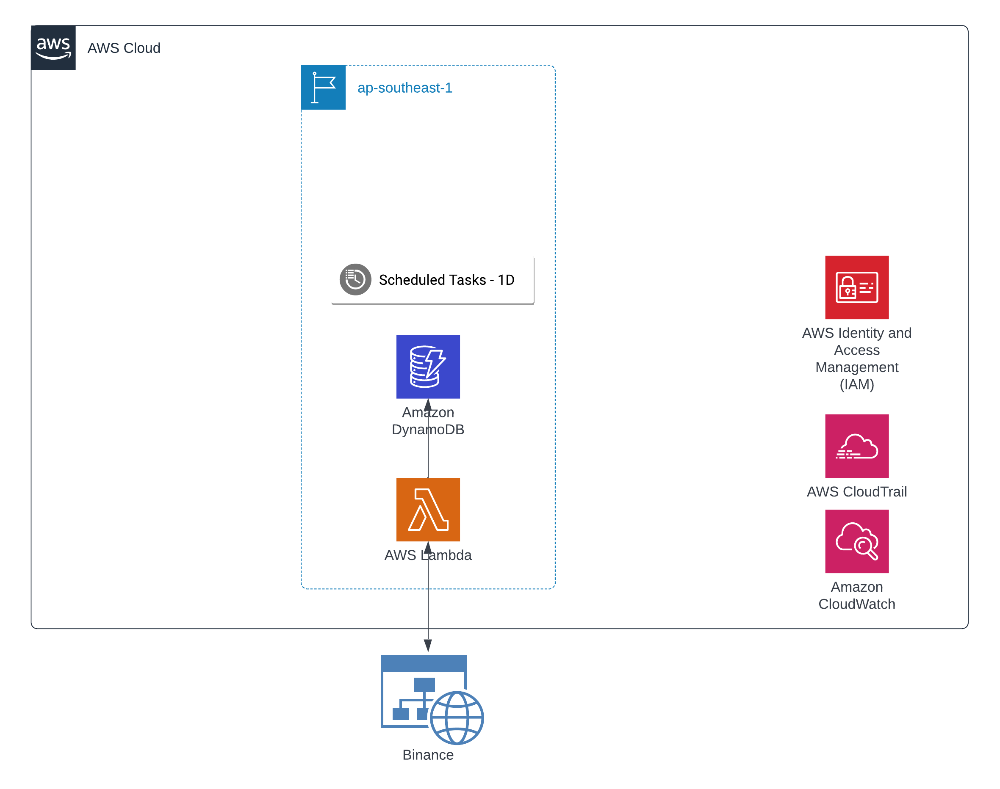

# crypto-volume-tracker
Based on binance pairs 

## Features
MVP
- Track volume change of crypto future pairs from binance 
- Recommendation pair that should deep analysis on  1Hr and 4Hr
- Fake call statistic 

Phase 2
- Send alert to discord channel

## High level design

### Technology stack
- React (UI)
- NodeJs (Lambda)
- Terraform (IaC)
- AWS DynamoDB (DB)

### Sequence diagram

### Deployment view

#### Application

#### Metadata Service

### Cost projection
Total cost [1.59](https://calculator.aws/#/estimate?id=7e4f5c441ab962270b44a77d47a3107ca8e86036) USD /month
