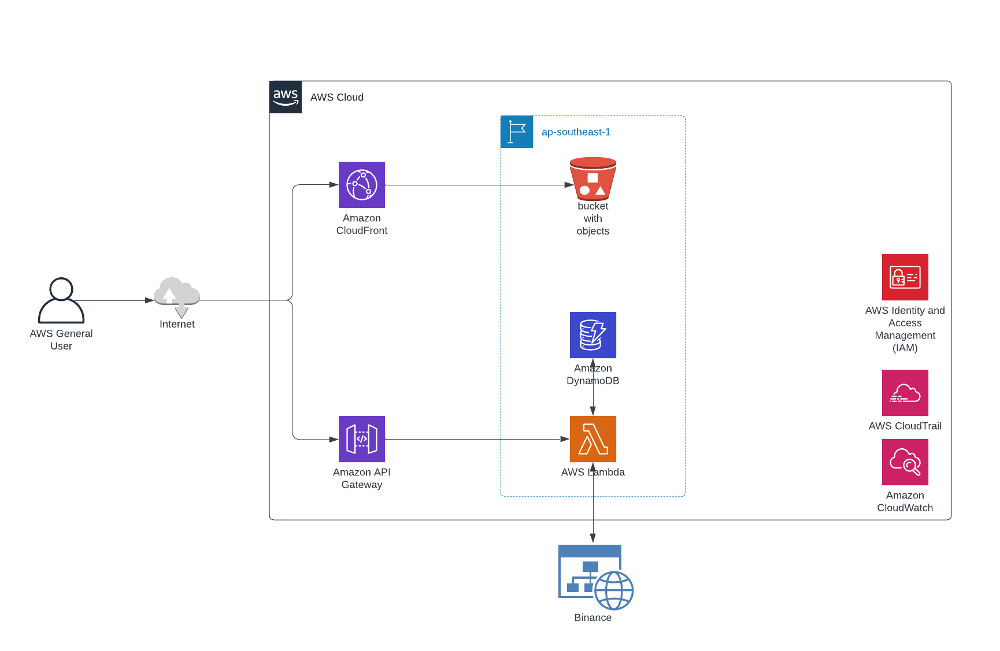

# crypto-volume-tracker
Based on binance pairs 

## Features
MVP
- Track volume change of crypto future pairs from binance 
- Recommendation pair that should deep analysis on  1Hr and 4Hr

Phase 2
- Send alert to discord channel

## High level design

### Technology stack
- React (UI)
- NodeJs (Lambda)
- Terraform (IaC)
- AWS DynamoDB (DB)

### Sequence diagram

### Deployment view

#### Application

#### Metadata Service

